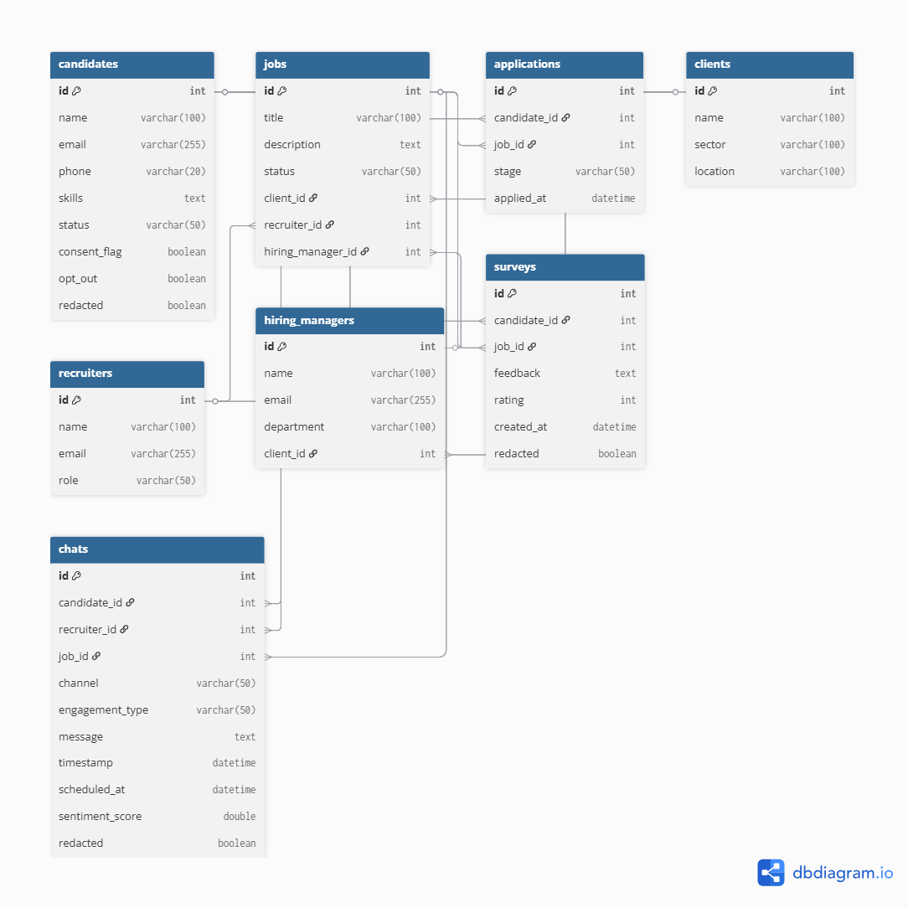

# CanvasCore
# AI-Powered Unified ATS + CRM Recruitment Platform

## Overview
In a competitive talent market, recruitment requires more than filling vacancies — it demands precision matching, efficient workflows, and actionable insights.  
This open-source platform fuses an **Applicant Tracking System (ATS)** with a **Customer Relationship Management (CRM)** tool into a single, high-performance solution. Leveraging **AI-driven candidate-role matching**, **natural language processing**, and **real-time analytics**, it enables recruiters to focus on relationships rather than repetitive tasks. An authentic communication model is created for interaction with messaging and emails for candidates & recruiters, recruiters & Hiring Managers, Clients & Hiring Managers to keep the lines of communication open and transparent. 

Built with a lean, modern stack, the system is optimized for rapid deployment, scalability, and extensibility — without sacrificing performance or compliance.

---

## Key Features
- **Unified ATS + CRM**: Complete lifecycle management for candidates, jobs, and client relationships.
- **AI-Powered Matching**: `scikit-learn` + `spaCy` parse CVs and job descriptions beyond keyword matching.
- **Advanced Analytics**: Real-time dashboards in Power BI with pipeline, time-to-hire, and recruiter performance metrics.
- **Privacy & Compliance by Design**: GDPR-compliant data workflows with granular access controls.
- **Modular Architecture**: Backend, frontend, AI, and analytics components decoupled for easy extension.
- **Deployment-Ready**: Optimized for cloud hosting on Render or Railway with minimal configuration.

---

## Tech Stack
| Component      | Technology         | Rationale |
|----------------|--------------------|-----------|
| **Backend**    | Python + FastAPI   | High-performance REST APIs, async support, easy AI integration. |
| **Frontend**   | Streamlit          | Rapid UI prototyping and deployment without front-end overhead. |
| **Database**   | PostgreSQL / SQLite| Scalable, robust, widely supported in production environments. |
| **AI / ML**    | scikit-learn, spaCy| Proven libraries for NLP, text similarity, and candidate scoring. |
| **Analytics**  | Power BI           | Industry-standard BI tool for live metrics and KPIs. |
| **Deployment** | Render / Railway   | Lightweight, fast deployments with CI/CD support. |

---

## Core features for the MVP

ATS: Multi-stage pipelines; bulk actions; interview scheduling placeholders; offer tracking; SLA timers; ageing and inactivity flags.

CRM: Accounts/Contacts; role briefs; activity timeline; tasks/reminders; simple Kanban for opportunities.

Search & match: Basic text + tag search; shortlist generator; duplicate candidate resolver.

Reporting: Funnel conversion, time-to-fill, offer acceptance, source quality, recruiter activity; “aging by stage” heatmap.

Compliance: Consent flag, opt-out log, redact function for test data.

## Installation
```bash
# Clone repository
git clone https://github.com/Delaine-grace/CanvasCore.git
cd CanvasCore

# Create virtual environment
python -m venv venv
source venv/bin/activate  # Mac/Linux

# Install dependencies
pip install -r requirements.txt

# Run backend
uvicorn main:app --reload

# Run frontend
streamlit run app.py

```
## CanvasCore ERD

## CanvasCore ERD



**Description:**  
This ERD illustrates the CanvasCore platform, showing ATS entities (Candidates, Jobs, Applications), CRM entities (Clients, Recruiters, Hiring Managers), and Candidate Engagement (Chats, Surveys).  

It demonstrates innovative CRM-style engagement and incorporates GDPR-compliant fields (`consent_flag`, `opt_out`, `redacted`) for secure handling of candidate data. Sensitive information like emails, phone numbers, and messages are encrypted. Color coding distinguishes ATS (blue), CRM (green), and Candidate Engagement (orange) entities.


This project is licensed under the [MIT License](LICENSE).

